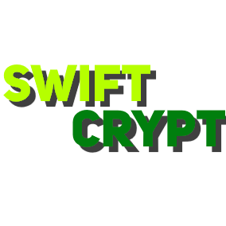

<p align="center">
  
</p>

<h1 align="center">SwiftCrypt</h1>

<p align="center">
  <b>Versatile Python module for enhanced security utilities</b>
</p>

<p align="center">
  <a href="https://pypi.org/project/swiftcrypt/"></a>
  <a href="https://www.python.org/downloads/release"></a>
  <a href="https://pypi.org/project/swiftcrypt/"></a>
</p>

### Downloads isnt showing cuz its a new package for some reason?


## Features

- **Secret Generation:** Create random secrets, keys, UUIDs, and passwords using various character sets and customizable configurations.
- **Data Transformation:** Encode and decode data with Base64 and hexadecimal. Securely erase sensitive data using random bytes.
- **Advanced Generation:** Tailor key and password generation with options for uppercase, dual cases, and more.
- **Password Strength Checker:** Evaluate password strength based on length, character types, and more.
- **Password Hashing:** Hash passwords using the SHA-256 algorithm with advanced salting.
- **Salt Generation:** Generate unique salts for enhanced password security.

## Installation

Install SwiftCrypt using `pip`:

```bash
pip install swiftcrypt
```
# Usage
Here's a quick example of generating a secure password using SwiftCrypt:

```python
from swiftcrypt import SecretGenerator

generator = SecretGenerator()
password = generator.generate_password(length=12, numbers=True, special_characters=True)
print("Generated Password:", password)
```
Check out our documentation for more detailed instructions and examples.

# Contribution
We welcome contributions! If you encounter issues or want to enhance SwiftCrypt, please submit a pull request or open an issue.

# License
SwiftCrypt is licensed under the MIT License.

Feel free to use SwiftCrypt in your projects and enjoy a safer development experience! If you have any questions or need assistance, please don't hesitate to reach out.

